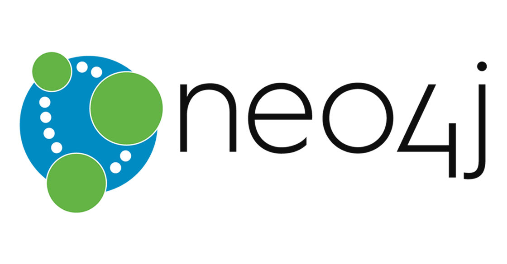

<!-- page_number: true -->
<!-- footer: Introduction au NoSQL -->

Introduction au *NoSQL*
===


##### Concept et cas pratiques

###### par [Fabien Barbaud](fabien.barbaud@timeonegroup.com) - [@BarbaudFabien](https://twitter.com/BarbaudFabien)

---

# Définition générale

Le terme *NoSQL* définit une famille de [systèmes de gestion de base de données](https://fr.wikipedia.org/wiki/Syst%C3%A8me_de_gestion_de_base_de_donn%C3%A9es) (SGBD) qui, de par sa conception, s'écarte du paradigme des [bases relationnelles](https://fr.wikipedia.org/wiki/SGBDR).

Les bases *NoSQL* sont généralement conçues pour traiter un **volume de données important** en utilisant une **architecture distribuée**.

Ce type de SGBD est apparu à partir des années 2000 pour répondre aux problématiques [*Big Data*](https://github.com/fabienbarbaud/intro-bigdata).

[Wikipedia](https://fr.wikipedia.org/wiki/NoSQL)

---

# Le *NoSQL*, ce n'est pas :

* *Not SQL* mais *Not only SQL* (ou plutôt *NoRel* - *not only relational*)
* Un ensemble uniforme de SGBD
* Un remplaçant aux bases relationnelles

---

# Théorème CAP

Les bases de données *NoSQL* reposent sur trois principes issus du théorème de CAP d’Eric Brewer :

* Consistance (*Consistency*) : tous les clients voient les mêmes donnnées en même temps
* Disponibilité (*Availability*) : toutes les requêtes reçoivent une réponse
* Tolérance au partitionnement (*Partition Tolerance*) : aucune panne moins importante qu'une coupure totale du réseau ne doit empêcher le système de répondre correctement

D'après ce théorème, un système de calcul distribué ne peut garantir à un instant T que deux de ces contraintes mais pas les trois. [Wikipedia](https://fr.wikipedia.org/wiki/Th%C3%A9or%C3%A8me_CAP)

---

# Les différents types *NoSQL*

* base **clé/valeur**
* base orientée **colonne**
* base orientée **document**
* base orientée **graphe**

--- 

# Les différents types *NoSQL*

## Base clé/valeur

key | value
--- | ---
key_1 | value_1
key_2 | value_2

* *GET*
* *SET*
* *DELETE*

---

# Base clé/valeur

## Redis


Redis is an open source (BSD licensed), in-memory data structure store, used as a database, cache and message broker. It supports data structures such as strings, hashes, lists, sets, sorted sets with range queries, bitmaps, hyperloglogs and geospatial indexes with radius queries. https://redis.io/

---

# Base clé/valeur

## Redis - tutoriel

```
$ docker pull redis
$ docker run --name some-redis -d redis
$ docker exec -it some-redis bash
root@af8f46c12686:/data# redis-cli
127.0.0.1:6379> PING
PONG
```

[Redis Tutorial](https://www.tutorialspoint.com/redis/index.htm)

--- 

# Les différents types *NoSQL*

## Base orientée colonne

key | column_1 | column_2 | column_3 | column_4 | column_5
--- | --- | --- | --- | --- | ---
key_1 | blue | red |
key_2 | | | green 
key_3 | | | yellow | white | black

Base de données relationnelles

--- 

# Les différents types *NoSQL*

## Base orientée colonne

key | |
--- | --- 
key_1 | `column_1:blue` `column_2:blue` 
key_2 | `column_3:green` 
key_3 | `column_3:yellow` `column_4:white` `column_5:black`

Base de données orientée colonne

[HBase](https://github.com/fabienbarbaud/intro-bigdata/blob/master/bigdata-intro.md#hbase) - [Cassandra](https://github.com/fabienbarbaud/intro-bigdata/blob/master/bigdata-intro.md#cassandra)

---

# Les différents types *NoSQL*

## Base orientée document


---

# Base orientée document

## MongoDB


MongoDB **stores data in flexible, JSON-like documents**, meaning fields can vary from document to document and data structure can be changed over time - [MongoDB](https://www.mongodb.com/what-is-mongodb)

---

# Base orientée document

## MongoDB - tutoriel

```
$ docker pull mongo
$ docker run --name some-mongo -d mongo
$ docker exec -it some-mongo bash
root@12d5d59f48d0:/# mongo
```

[MongoDB Tutorial](https://www.tutorialspoint.com/mongodb/index.htm)

---

# Les différents types *NoSQL*

## Base orientée graphe

Une base de données orientée graphe est **une base de données orientée objet** utilisant la **théorie des graphes**, donc avec **des nœuds et des arcs**, permettant de **représenter et stocker les données**.

[Wikipedia](https://fr.wikipedia.org/wiki/Base_de_donn%C3%A9es_orient%C3%A9e_graphe)

---

# Les différents types *NoSQL*

## Base orientée graphe


---

# Base orientée graphe

## Neo4j



---

# Base orientée graphe

## Neo4j - tutoriel

```
$ docker pull neo4j:3.0
$ docker run -p 7474:7474 --name some-neo4j -d neo4j:3.0
```

```
http://$(docker-machine ip default):7474
```


